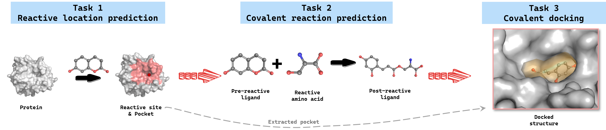

# CovDocker: Benchmarking Covalent Drug Design with Tasks, Datasets, and Solutions

# Overview
Molecular docking plays a crucial role in predicting the binding mode of ligands to target proteins, and covalent interactions, which involve the formation of a covalent bond between the ligand and the target, are particularly valuable due to their strong, enduring binding nature. However, most existing docking methods and deep learning approaches hardly account for the formation of covalent bonds and the associated structural changes. To address this gap, we introduce a comprehensive benchmark for covalent docking, CovDocker, which is designed to better capture the complexities of covalent binding. We decompose the covalent docking process into three main tasks: reactive location prediction, covalent reaction prediction, and covalent docking. By adapting state-of-the-art models, such as Uni-Mol and Chemformer, we establish baseline performances and demonstrate the effectiveness of the benchmark in accurately predicting interaction sites and modeling the molecular transformations involved in covalent binding. These results confirm the role of the benchmark as a rigorous framework for advancing research in covalent drug design. It underscores the potential of data-driven approaches to accelerate the discovery of selective covalent inhibitors and addresses critical challenges in therapeutic development. 




## Setup Environment

**As the trained model checkpoint is included in the HuggingFace repository with git-lfs, you need to install git-lfs to pull the checkpoints correctly.**
```bash
sudo apt-get install git-lfs 
git lfs install
git clone https://github.com/PoloWitty/CovDocker.git --recursive

# Create a new environment with required packages using env.yml 
conda env create -f env.yaml

conda activate covDocker

# set up unimol-core
wget https://github.com/dptech-corp/Uni-Core/releases/download/0.0.3/unicore-0.0.1+cu118torch2.0.0-cp38-cp38-linux_x86_64.whl
pip install 'unicore-0.0.1+cu118torch2.0.0-cp38-cp38-linux_x86_64.whl'
rm -rf unicore-0.0.1+cu118torch2.0.0-cp38-cp38-linux_x86_64.whl

# set up pysmilesutils
python -m pip install git+https://github.com/MolecularAI/pysmilesutils.git

# (Optional) download unimol pretrained weight if you want to train the model from scratch
mkdir -p unimol_weight
pushd unimol_weight
wget https://github.com/dptech-corp/Uni-Mol/releases/download/v0.1/mol_pre_no_h_220816.pt # molecular pretrained weight
wget https://github.com/dptech-corp/Uni-Mol/releases/download/v0.1/pocket_pre_220816.pt # pocket pretrained weight
popd

# (Optional) mmseq2 to get low homology set
conda install -c conda-forge -c bioconda mmseqs2

```

<details>
<summary>Error when setting up env?</summary>

- if there is a ImportError: /lib/x86_64-linux-gnu/libstdc++.so.6: version GLIBCXX_3.4.29 not found, `conda uninstall pandas` and then `pip install pandas` or `conda uninstall scikit-learn` and then `pip install scikit-learn`, `pip install scikit-learn-extra`.

- if there is a numba SystemError: initialization of _internal failed without raising an exception, `conda install "numpy>=1.16.5, <1.23.0"`

- if  Error: libXrender.so.1: cannot open shared object file: No such file or directory, `sudo apt-get update` and then `sudo apt-get install libxrender1 libxext6`

</details>

## Data
We provide the processed dataset on [zenodo](https://zenodo.org/records/14738851).

1. download processed dataset from [zenodo](https://zenodo.org/records/14738851).
2. unzip the zip file and place it into `./data/` dir such that the `./data/` dir become as follow
```text
data
├── amino_acids # amino acids' structure files used when pre-processing the data
│   ├── ALA.cif
.....
│   └── VAL.cif
└── processed
    ├── bonded
    │   ├── 1A0L
    │   │     ├── 1A0L_10Apocket.pdb 
    │   │     ├── 1A0L_5Apocket.pdb
    │   │     ├── 1A0L_8Apocket.pdb
    │   │     ├── 1A0L_chain_within_10A.pdb
    │   │     ├── 1A0L_ligand.pdb # ligand part from original complex pdb file
    │   │     ├── 1A0L_ligand.sdf # ligand pdb structure aligned with coresponding SMILES
    │   │     └── 1A0L_protein.pdb # protein part from original complex pdb file
    .....
    │   └── 9XIA
    ├── dataset # lmdb files used for deep learning model
    │   ├── docking 
    │   ├── reaction
    │   └── reactive_site
    ├── dataset.csv # used for task2 and task3 (n=2754)
    ├── dataset.filtered.csv # used for task1 (n=2717)
    ├── dataset.filtered.unseen.csv # used for task1 unseen test set (67 unseen test samples)
    ├── dataset.unseen.csv # used for task2 and task3 unseen test set (68 unseen test samples)
    └── pdb2mechanism.csv # (n=2754)
```

## Model
Model checkpoints is placed under `./covDocker_models/`, which will be automatically downloaded when cloning this reporsitory with `--recursive`.

You can also manually download the pre-trained model from [Hugging Face](https://huggingface.co/polowitty/covDocker_models/tree/main).

# Infer

## Task1: Reactive Location Prediction
```bash
bash scripts/eval_reactive_site.sh
```

## Task2: Covalent Reaction Prediction
```bash
pushd cov_reaction_pred_baselines/Chemformer
bash example_scripts/covDocker_eval.sh
popd
```

## Task3: Covalent Docking Pose (cov-docking) Prediction
```bash
bash scripts/eval_cov_docking_pose.sh
```

## Pipeline
```bash
bash scripts/docking_from_inferred_pocket.sh
```

# Train

## Task1: Reactive Location Prediction
```bash
bash scripts/train_reactive_site.sh
```

## Task2: Covalent Reaction Prediction
```bash
pushd cov_reaction_pred_baselines/Chemformer
download last.ckpt from https://az.app.box.com/s/7eci3nd9vy0xplqniitpk02rbg9q2zcq/folder/145318675420 and rename it to uspto_sep_finetuned_last.ckpt
bash example_scripts/covDocker_train.sh
popd
```

## Task3: Covalent Docking Pose (cov-docking) Prediction
```bash
bash scripts/train_cov_docking_pose.sh
```

For Fpocket, P2Rank, ReactionT5, and T5Chem, you may see more details under the corresponding folders.

## About

### Acknowledegments
We appreciate [FABind](https://github.com/QizhiPei/FABind/tree/main), [Uni-Mol](https://github.com/deepmodeling/Uni-Mol/tree/main), [RFAA](https://github.com/baker-laboratory/RoseTTAFold-All-Atom/tree/main), [Chemformer](https://github.com/MolecularAI/Chemformer/tree/main) and other related works for their open-sourced contributions.